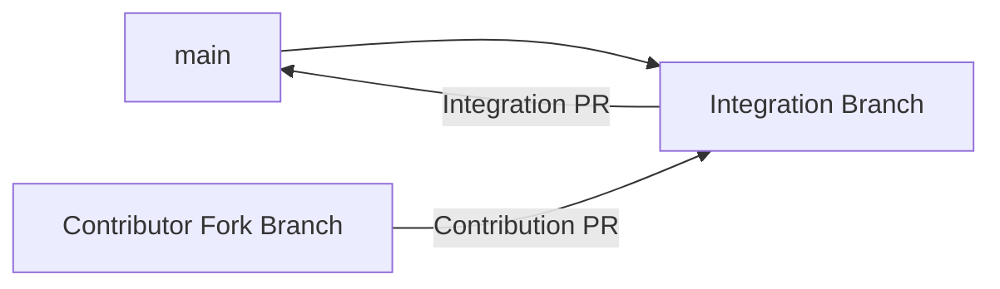
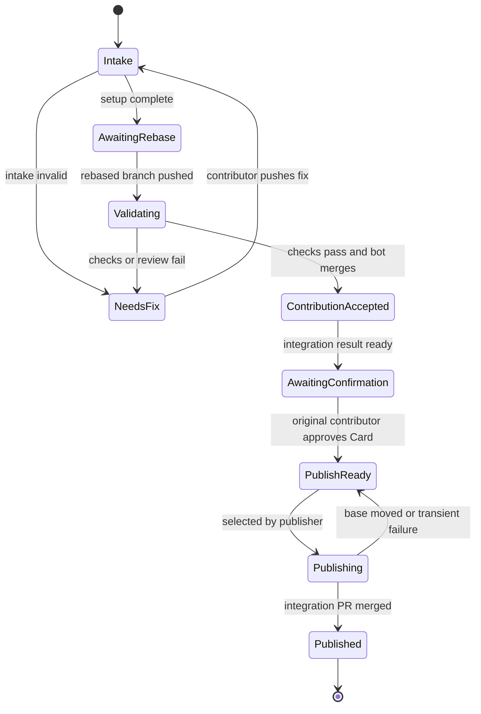

# Hello from Main 产品设计

## 文档状态

本文记录 grilling 后已经对齐的产品基线。它描述产品承诺、教程协议和实现必须维护的不变量，不规定具体编程语言或 Action 框架。

当前项目名为 **Hello from Main**，核心练习名为 **Good First Conflict**。项目以中文为主，标题和少量 Git/GitHub 术语可以使用英文。

## 一句话定义

Hello from Main 是一个一次性、全自动的 Git 与 GitHub 协作教程：参与者把一句自己的话经过 Fork、Branch、Commit、Pull Request、Rebase、Conflict、Review 和 Merge，最终留在项目的 `main` 中。

## 问题与价值

多数入门教程会把 Git 操作拆成孤立命令，或者刻意避开冲突。学习者即使执行过 `commit` 和 `push`，也未必理解一份工作如何在真实协作中被同步、检查、接纳和发布。

本项目用一个范围很小但真实可见的贡献贯穿完整流程。参与者与项目自动化分别完成同一张 Card 的个人内容和项目外壳，再由参与者亲手把两边有效工作整合起来。

## 产品定位

### 首要定位

- 产品本体是一次性 Git/GitHub 协作教程。
- Card 和 Completion Wall 是教程完成后的纪念性结果，不是需要长期经营的社区产品。
- 确定性 Conflict 是必修环节，也是项目最独特的学习机制。
- 教程可以明确说明 Conflict 是项目协议有意保证的，但所有 branch、commit、PR、review 和 merge 都必须真实发生，并符合场景中的责任分工。

### 目标用户

- 第一优先级是独立完成教程的 Git/GitHub 新手。
- 第二使用场景是 Workshop 或课堂中同时完成同一流程的一批参与者。
- 默认能力基线是会打开终端和编辑纯文本，但不假设理解 remote、upstream、rebase、force push、PR base 或 conflict marker。
- 第一版标准界面是本地 Git CLI 与 GitHub 网页，不同时维护 Desktop、IDE 和多套 CLI 教程。

### 非目标

- 不做持续课程平台、社区档案、年鉴、社交产品或个人主页托管。
- 不为了覆盖更多 Git 命令而强制制造无意义步骤。
- 不把 Stash 设为毕业条件；只有本地未提交修改真实阻塞 Rebase 时才提供提示。
- 不为了确保每个人都修改一次而制造虚假 Review 意见。
- 不允许人类 Maintainer 成为正常 Tutorial Run 的关键路径。
- 不承诺 Card 永久不可修改或不可删除。

## 设计原则

### 场景必须诚实

项目可以设计一项练习协议，但不能伪造偶然事件。教程应明确告诉参与者：项目故意让两个分支创建同一路径，以保证一次可解释、可恢复的 `add/add` Conflict；这不代表所有开源贡献都会经历相同冲突。

### Git 术语优先

轻量叙事只用于解释实际操作，不能替代 `branch`、`rebase`、`conflict`、`review` 和 `merge` 等真实术语。Integration Bot 是仓库自动化，不扮演虚构角色。

### 双方工作都必须有效

Conflict 不能有一边是明显垃圾或教学 marker。Contributor 的个人表达与项目生成的来源元数据都必须进入最终 Card，参与者需要理解内容归属并完成组合，而不是机械选择 ours 或 theirs。

### 自动化不隐藏决定

Bot 负责机械集成、校验、状态推进和发布。Contributor 仍需亲手完成需要理解和判断的 Git 操作，并检查自己的最终结果。

### 一次教程，一次身份

每个 GitHub `github_id` 只能完成一次 Tutorial Run。首次贡献走完整确定性流程；完成后的 Card 更新走普通 PR，不再人为制造 Conflict。

## 成果模型

### Contributor 输入

参与者只填写严格结构的纯文本，不编辑 YAML：

```md
# 小黑

最近在折腾：TypeScript / Agent / Git

> 希望以后看到 Git conflict 不会下意识删仓库重来。
```

三个内容字段分别是：

- 昵称。
- 最近在折腾什么，可以是技术、摄影、游戏、考研等任何安全的纯文本。
- 一句想留在这里的话。

第一版不允许参与者添加链接、外部图片、HTML、额外文件或自由 Markdown 结构。精确字符上限在实现前确定，但必须足以保证 README 卡片可读、移动端不过度膨胀，并限制垃圾内容的影响面。

### Bot 输入

Integration Bot 从可信的 GitHub event 和 API 获取来源信息，并创建 Project Shell：

```md
---
github: c-w-xiaohei
github_id: 12345678
avatar: https://avatars.githubusercontent.com/u/12345678?v=4
source_pr: 184
---

# @c-w-xiaohei

<!-- contributor content goes here -->
```

字段语义：

- `github`：当次贡献使用的 GitHub login，用于展示。
- `github_id`：GitHub 不可变用户 ID，用于执行“一人一次”。
- `avatar`：当次 GitHub API 返回的头像地址。
- `source_pr`：首次 Contribution PR 编号，用于追溯真实贡献历史。

不保存 `verified: true`。Card 能进入 `main` 已经表示它通过项目协议，重复保存布尔状态没有新增事实。

### 最终 Card

参与者解决 Conflict 后形成：

```md
---
github: c-w-xiaohei
github_id: 12345678
avatar: https://avatars.githubusercontent.com/u/12345678?v=4
source_pr: 184
---

# 小黑

最近在折腾：TypeScript / Agent / Git

> 希望以后看到 Git conflict 不会下意识删仓库重来。
```

文件路径为 `people/<首次贡献时的-github-login>.md`。`github_id` 而不是文件名承担稳定身份判断。

## 责任边界

| 参与方 | 拥有的责任 |
| --- | --- |
| Contributor | 个人内容、自己的 Git 分支、Conflict 组合决定、最终 Card 确认 |
| Integration Bot | Project Shell、GitHub 来源信息、Integration Branch、PR 编排、机械校验和状态反馈 |
| Publisher | 串行刷新发布分支、保留已接纳的 Contribution 历史、从事实源生成 README、自动合入 `main`、失败重试 |
| Project Maintainer | 开发项目和 Action、制定协议、处理系统异常、事后内容治理和项目演进 |

Project Maintainer 不参与正常 Tutorial Run，但可以在教程之外处理安全事件、删除违规内容或修复自动化。

## 端到端流程

### 1. 静态教程

参与者先在没有 Action 干预的情况下完成基础 Git 路径：

```text
Fork
Clone 自己的 Fork
配置 upstream
创建 add/<login> 分支
复制 people/_template.md
填写 people/<login>.md
git status
git add
git commit
git push -u origin add/<login>
向上游 main 创建 Pull Request
```

此时参与者已经完成 `branch -> edit -> add -> commit -> push -> PR`。

### 2. 创建隔离集成环境

Integration Bot 接收 Contribution PR 后执行幂等设置：

1. 验证 PR author、Fork、分支、文件路径和变更范围满足 intake 规则。
2. 从当时的 `main` 创建 `feature/card-<login>-<source-pr>`。
3. 在 Integration Branch 上独立创建同一路径的 Project Shell。
4. 创建 Draft Integration PR：`feature/card-... -> main`。
5. 将 Contribution PR 的 base 从 `main` 改为对应 Integration Branch。
6. 评论解释双方责任、分支关系和下一步 Rebase 命令。



### 3. 同步并解决确定性 Conflict

Bot 指导参与者执行：

```bash
git fetch upstream
git rebase upstream/feature/card-<login>-<source-pr>
```

双方独立创建同一路径，因此 Git 稳定产生：

```text
CONFLICT (add/add): people/<login>.md
```

Bot 解释整合规则，但不直接提供可复制的最终答案：

- 保留项目生成的 `github`、`github_id`、`avatar` 和 `source_pr`。
- 保留 Contributor 的昵称和正文。
- 删除 Project Shell 占位内容。
- 删除所有 conflict marker。

参与者继续：

```bash
git add people/<login>.md
git rebase --continue
git push --force-with-lease
```

教程解释 Rebase 后 Contributor commit 获得新 ID，因为它被重新应用到了 Integration Branch 的新基础上。

### 4. 自动 Review 与接纳 Contribution

Contribution PR 更新后，自动化执行真实检查：

```text
GitHub identity matches PR author
Only the expected Card changed
Nickname is present and not template text
Exploring text is present and not template text
Message is present and not template text
No conflict markers remain
Project metadata is complete and API-derived values match
Markdown follows the exact Card structure
No forbidden links, images, HTML, control characters or extra syntax
Contributor commit is based on the expected Integration Branch state
```

如果有问题，Bot 给出具体 Review 反馈；如果第一次就正确，直接确认 `Card looks good`。不得为了教学节奏故意挑错。

Checks 全部通过后，Integration Bot 自动使用 merge commit 将 Contribution PR 接纳到 Integration Branch。使用 merge commit 是为了保留参与者 Rebase 后的 commit，而不是在接纳时再次改写它。

### 5. 生成最终集成结果

Contribution PR 合入后，Bot：

1. 根据 Integration Branch 中的 `people/*.md` 生成 README 卡片区域。
2. 更新 Draft Integration PR，使其展示 Card 与 README 变化。
3. 将 Integration PR 标为 Ready for Review。
4. 引导原始 Contributor 检查自己的 Card 并提交 GitHub `Approve` Review。

Contributor 可以在公开仓库 Review Integration PR，因为它不是该 PR 的作者。其 Approval 只在以下条件下对教程状态有效：

- Reviewer login 等于原始 Contribution PR author。
- Review state 为 `approved`。
- Integration PR 与该 Tutorial Run 绑定。
- Review 指向的版本包含与当前候选相同的 Card blob。

其他用户仍可查看、评论或 Review 公开 PR，但不能推进不属于自己的 Tutorial Run。

### 6. 串行自动发布

Contributor Confirmation 到达后，Integration PR 进入发布队列。Publisher：

1. 记录 Contributor 已确认的 Card blob SHA。
2. 在全仓库唯一的发布临界区内选择下一张 ready Card。
3. 将最新 `main` 安全整合进该 Integration Branch，同时保留已接纳的 Contribution 历史。
4. 原样放入已经确认的 Card。
5. 扫描最新 `people/*.md`，确定性重建 README 生成区。
6. 验证 Card blob 未变化，且 PR 只包含该 Card 与 README 生成区。
7. 使用期望 head SHA 自动 Merge Integration PR。
8. 失败时重新读取最新状态、重建并安全重试。

Contributor Confirmation 的对象是其 Card，不是整个生成 README。其他 Card 在排队期间进入 `main` 时，Publisher 可以刷新 README，而无需参与者重新 Approval；只要其已确认 Card 的 blob 没有变化。

### 7. 完成

Integration PR 合入后：

- `people/<login>.md` 正式存在于 `main`。
- README 的“来自 main 的留言”区域出现头像、昵称、GitHub login、最近在折腾什么和留言。
- Card 链接到完整 Markdown 文件，来源可以追溯到 Contribution PR。
- Bot 在相关 PR 留下完成状态和最终链接。
- 临时 Integration Branch 可被清理。

## Git 语义

### Rebase 前

```text
         X  Contributor content
        /
A -----+
        \
         M  Project Shell
```

### Rebase 后

```text
A ----- M ----- X'
```

`M` 先成为集成基础，`X` 在新基础上重新应用为 `X'`。Conflict 表示 Git 无法替项目决定同一路径的最终内容，不表示任一方的工作应该被整体丢弃。

### 两张 PR 的不同含义

```text
Contribution PR: Contributor work -> Integration Branch
含义：项目自动化检查并接纳参与者完成的工作。

Integration PR: Integration Branch -> main
含义：完整结果准备进入项目；Contributor 检查自己的 Card，Publisher 负责最终合入。
```

Contributor 没有上游仓库 Merge 权限，也不需要获得该权限。Bot 执行两次 Merge，Contributor 在第二张 PR 中练习真实 Review。

## README 生成规则

README 中只有明确标记的区域由 Publisher 管理：

```md
<!-- cards:start -->
<!-- generated from people/*.md; do not edit manually -->
...
<!-- cards:end -->
```

必须维护以下不变量：

- `people/*.md` 是唯一事实源。
- README 生成区可以由固定输入完全重现。
- 人工修改生成区会被下一次生成覆盖。
- Publisher 不修改生成区以外的 README 内容。
- Publisher 刷新分支时不得丢弃 Contribution PR 已接纳的 commit 历史。
- 输出顺序必须确定性稳定；具体排序规则在实现前确定。
- 每张 README Card 至少展示头像、昵称、GitHub login、最近在折腾什么和留言，并链接到完整 Markdown。
- README 是 GitHub 首页的主要成果展示，不以独立 Pages 页面替代。

## 状态模型



任何事件都可能重复投递。每次状态推进都必须先读取 GitHub 当前事实，并保证重复执行不会创建第二个分支、第二张 Integration PR、重复评论或重复 Merge。

## 自动化与安全边界

### 全自动硬约束

- 正常 Tutorial Run 从 PR 创建到发布不得等待人类 Maintainer。
- Fork PR workflow 不得依赖 Maintainer 手动批准后才能开始。
- 超时、取消、漏触发和并发竞争必须由重试或 watchdog 恢复。
- 人类 Maintainer 只处理系统缺陷和事后内容治理。

### 不可信输入

外部 Fork 的全部内容都视为不可信。高权限自动化必须遵守：

- 只运行默认分支上的可信 workflow 和实现。
- 不 checkout 后执行 Contributor 提供的代码、脚本、依赖或 Action。
- 通过 GitHub API 读取并将预期 Card blob 当作被动文本解析。
- 在授予写权限前先验证 PR 只修改一个预期路径。
- 每个 job 使用完成职责所需的最小 token 权限。
- 不把 PR 标题、branch 名、Markdown 内容等未转义输入拼入 shell 命令。
- Integration Bot 只能操作与触发者 `github_id` 和 source PR 绑定的资源。

具体采用 GitHub App、`GITHUB_TOKEN` 配合显式 dispatch，或其他可信触发方式，需要在实现设计中验证事件递归、权限和 required checks 行为；不得选择需要人工批准 Fork workflow 的方案。

### 内容治理

全自动发布意味着违规纯文本可能在人工发现前短暂进入 `main`。第一版通过严格结构、禁止链接和 HTML、一账号一张 Card、长度限制和自动规则缩小风险，但不能宣称自动规则能理解所有自然语言滥用。

项目必须保留事后删除、封禁和紧急停止发布的能力，这些治理动作不属于正常教程关键路径。

## 失败恢复

### 本地未提交修改

如果 Rebase 因本地修改失败，教程按需提示：

```bash
git stash
git rebase upstream/feature/card-<login>-<source-pr>
git stash pop
```

没有遇到该情况的参与者不需要学习或执行 Stash。

### 错误 Conflict 解决

如果参与者只保留一边、遗留 marker 或破坏结构，Checks 给出具体字段级反馈，参与者继续在自己的分支修复并 push。

### Force push 竞争

教程只使用 `--force-with-lease`。如果远端分支在本地未见的情况下变化，命令应失败并引导参与者重新 fetch 和确认，而不是覆盖远端状态。

### 发布竞争

Publisher 不假设 Integration PR 创建时的 `main` 仍是最新。每次发布都将最新 `main` 整合进 Integration Branch，在保留已接纳 Contribution 历史和已确认 Card blob 的前提下重建 README，并在 Merge 时传入期望 head SHA。出现 base 移动、head 变化或临时 API 失败时，当前任务回到 `PublishReady` 并重试。

### Workflow 漏触发

除事件驱动流程外，必须有周期性 watchdog 扫描未终止 Tutorial Run，并从 GitHub 当前事实恢复下一步。Workflow concurrency 只能保护临界区，不能被当作持久队列，因为 pending run 可能被新运行替换。

## 生命周期与治理

- Card 以长期保留为理想体验，但不是不可变记录或永久承诺。
- Contributor 可以通过普通 PR 更新自己的 Card，或申请删除。
- 完成后的修改不再触发 Good First Conflict 流程。
- Project Maintainer 可以因隐私、安全、垃圾内容或社区规则下架 Card。
- GitHub login 变化时以 `github_id` 识别原 Contributor；是否自动迁移文件名留待实现策略决定。

## 验收标准

### 学习结果

完成者实际执行并理解：

- Fork、Clone、remote/upstream 和工作分支。
- Edit、Status、Add、Commit 和 Push。
- 创建 Pull Request 与理解 base/head。
- Fetch 与 Rebase 到变化后的集成基础。
- 读取并人工解决一次真实 `add/add` Conflict。
- `git add`、`git rebase --continue` 和 `git push --force-with-lease`。
- 阅读 Checks 与自动 Review 反馈。
- Review 并 Approve 一张不是自己创建、且其中唯一新增个人内容属于自己的 PR。
- 区分 Contribution 进入 feature 与完整 feature 进入 `main`。

### 系统结果

- 任意数量互不相关的 Tutorial Run 不会彼此制造非教学 Conflict。
- 同一 `github_id` 不能创建第二次首次 Tutorial Run。
- 正常流程完全自动化并可从重复、乱序和漏失事件恢复。
- 最终 Card 同时包含 Contributor 内容与 API 派生元数据。
- README 与 `people/*.md` 一致且可确定性重建。
- Contributor Confirmation 后 Card 内容不会在其不知情的情况下变化。
- Publisher 刷新 README 和 `main` 基础时不会丢失已接纳的 Contributor commit 历史。
- 外部 PR 内容从未在高权限上下文中作为代码执行。

## 已确认命名与文案

```text
Hello from Main

把一句自己的话，经过一次真实的 GitHub 协作，留在 main。
```

核心练习：

```text
Good First Conflict

很多入门教程会替你避开冲突。
这个教程会给你一次可控、可解释、可恢复的真实冲突。
```

README 成果区：

```text
来自 main 的留言
```

## 实现前仍需确定

以下项目没有在本轮 grilling 中决定，不应被误写成既定产品要求：

- 三个纯文本字段的精确字符上限和允许字符策略。
- README Card 的具体 HTML/Markdown 排版与确定性排序规则。
- Integration Bot 的认证方式，以及如何可靠触发 Bot 创建资源后的后续 workflows。
- Branch rules、required checks 与 Bot 自动 Merge 的具体配置。
- GitHub login 改名后的文件重命名策略。
- 自动内容规则、速率限制和紧急停止发布机制的具体实现。
